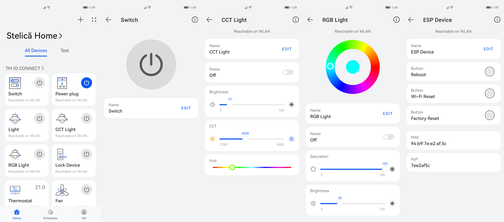

## TM IO Connect (App template) - ESP RainMaker

This isan  app template designed for IO Connect, and which is based on [ESP RainMaker](https://github.com/espressif/esp-rainmaker), an end-to-end solution offered by Espressif to enable remote control and monitoring for ESP32-S2 and ESP32 based products without any configuration required in the Cloud. 

## All standard devices, types, and params that can be used in IO Connect are shown in this app template.



## IO Connect Android app

Control all of your ESP RainMaker devices with IO Connect Android app.

[](https://play.google.com/store/apps/details?id=com.codor.stelian.ioconnect)
[](https://appgallery.cloud.huawei.com/ag/n/app/C104694841)
[](https://drive.google.com/file/d/1j-78cbTYLboyCpS3v1mciMzks87leLDc/view?usp=sharing)

## Development

Prepare [ESP-IDF development environment](https://docs.espressif.com/projects/esp-idf/en/latest/esp32/get-started/index.html#get-started-get-prerequisites).
As an alternative, you can use [PlatformIO](https://docs.platformio.org/en/latest/core/installation.html) to build and
flash the project.

Please initialize ESP RainMaker submodule using the below command:

```
git submodule update --init --recursive
```

## Build and Flash firmware

Follow the ESP RainMaker Documentation [Get Started](https://rainmaker.espressif.com/docs/get-started.html) section to build and flash this firmware. Just note the path of this example.

Upload firmware package (.zip archive consisting of the binary, elf, map file, and other information useful for analysis) which you can find in the build/ folder of your project by navigating to the [Firmware Images](https://dashboard.rainmaker.espressif.com/home/firmware-images) of the ESP RainMaker Dashboard. Create a new OTA job and you are ready.

## What to expect in this example?

- This example uses the BOOT button and RGB LED on the ESP32-S2-Saola-1/ESP32-C3-DevKitC board to demonstrate a switch.
- The LED state (green color) indicates the state of the switch.
- Pressing the BOOT button will toggle the state of the switch and hence the LED. This will also reflect on the phone app.
- Toggling the button on the phone app should toggle the LED on your board, and also print messages like these on the ESP32-S2 monitor:

```
I (16073) app_main: Received value = true for Switch - power
```

### LED not working?

The ESP32-S2-Saola-1 board has the RGB LED connected to GPIO 18. However, a few earlier boards may have it on GPIO 17. Please use `CONFIG_WS2812_LED_GPIO` to set the appropriate value.

### Reset to Factory

Press and hold the BOOT button for more than 3 seconds to reset the board to factory defaults. You will have to provision the board again to use it.

## License

    BSD 2-Clause License

    Copyright (c) 2021, Codor Stelian <codor.stelian.n@gmail.com>
    All rights reserved.
    
    Redistribution and use in source and binary forms, with or without
    modification, are permitted provided that the following conditions are met:
    
    1. Redistributions of source code must retain the above copyright notice, this
       list of conditions and the following disclaimer.
    
    2. Redistributions in binary form must reproduce the above copyright notice,
       this list of conditions and the following disclaimer in the documentation
       and/or other materials provided with the distribution.
    
    THIS SOFTWARE IS PROVIDED BY THE COPYRIGHT HOLDERS AND CONTRIBUTORS "AS IS"
    AND ANY EXPRESS OR IMPLIED WARRANTIES, INCLUDING, BUT NOT LIMITED TO, THE
    IMPLIED WARRANTIES OF MERCHANTABILITY AND FITNESS FOR A PARTICULAR PURPOSE ARE
    DISCLAIMED. IN NO EVENT SHALL THE COPYRIGHT HOLDER OR CONTRIBUTORS BE LIABLE
    FOR ANY DIRECT, INDIRECT, INCIDENTAL, SPECIAL, EXEMPLARY, OR CONSEQUENTIAL
    DAMAGES (INCLUDING, BUT NOT LIMITED TO, PROCUREMENT OF SUBSTITUTE GOODS OR
    SERVICES; LOSS OF USE, DATA, OR PROFITS; OR BUSINESS INTERRUPTION) HOWEVER
    CAUSED AND ON ANY THEORY OF LIABILITY, WHETHER IN CONTRACT, STRICT LIABILITY,
    OR TORT (INCLUDING NEGLIGENCE OR OTHERWISE) ARISING IN ANY WAY OUT OF THE USE
    OF THIS SOFTWARE, EVEN IF ADVISED OF THE POSSIBILITY OF SUCH DAMAGE.